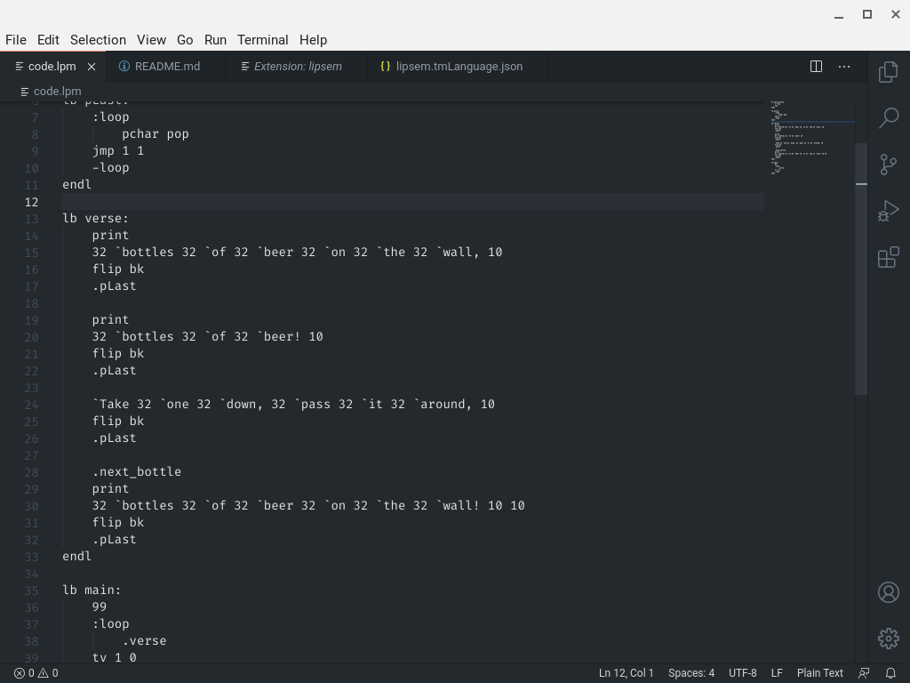
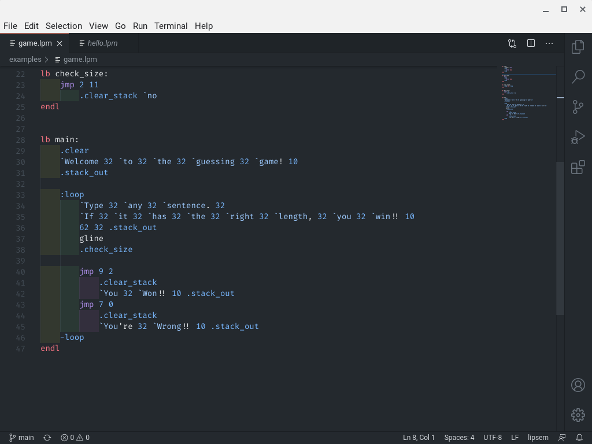

# vscode-lipsem

Lipsem syntax highlighting for VSCode. Lipsem's official repository can be found [here](https://github.com/Mespyr/lipsem)

### Without Syntax highlighting

### With Syntax highlighting

The theme is Github Dark.

To install this extension, you must clone this repository onto your computer, and move it to your `extensions` folder, located in `.vscode`. Then you can restart your editor to see the changes.